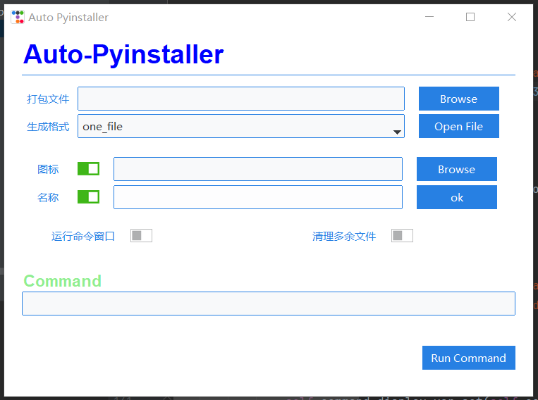

# Auto-Pyinstaller
- 自用py虚拟环境打包工具
- 由于使用pyinstaller打包程序会将本地环境中的所有未使用的包都打包进文件中,导致文件占用空间较大,推荐使用虚拟环境进行打包

# 使用方法
注: 请勿在虚拟环境中运行该程序且本地安装了pipenv模块

- 进入虚拟环境后通过pipenv install 模块名 命令安装程序中用到的所有模块
- 优先安装pyinstaller模块
- 通过pipenv graph命令确认安装成功
- 复制UI界面上Command中命令到cmd窗口中运行,等待结束
- 输入pipenv --rm命令删除虚拟环境,结束

